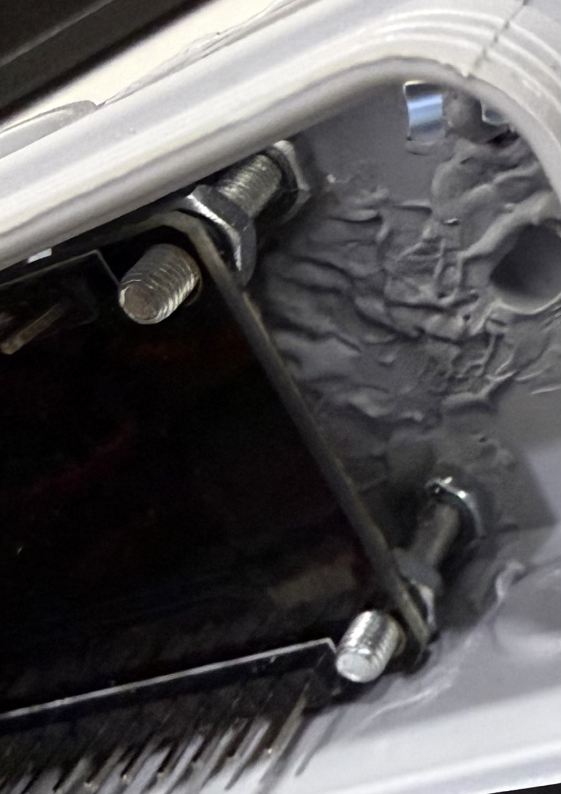
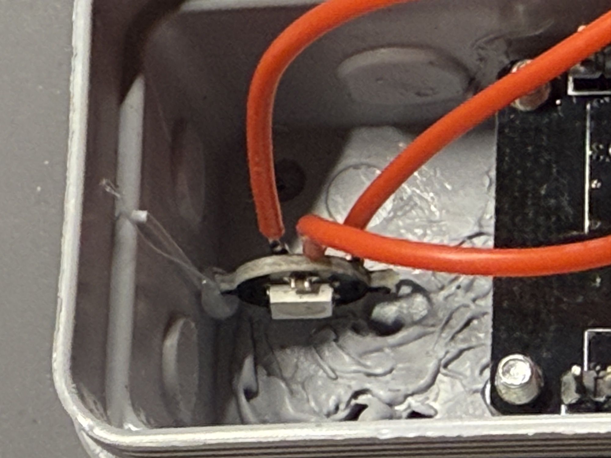
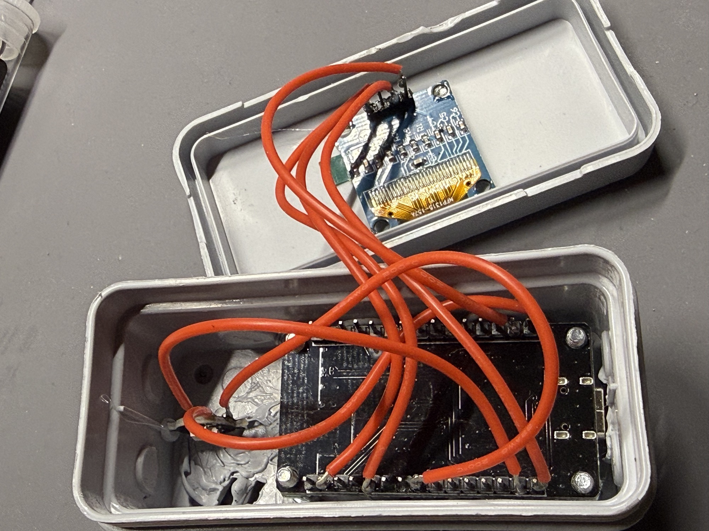
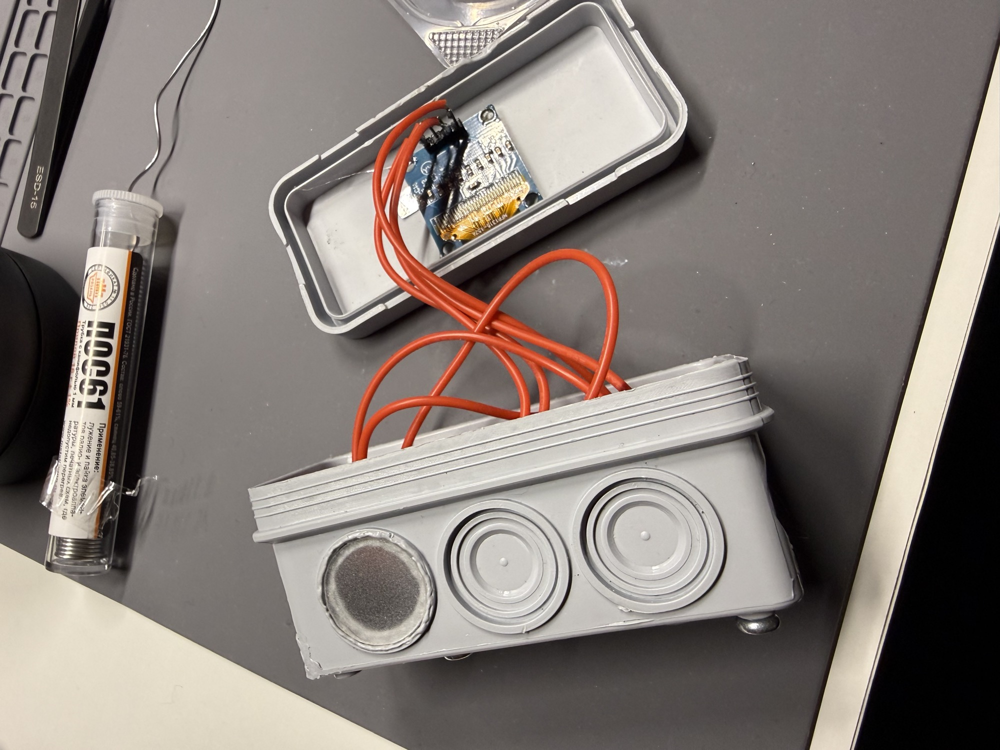
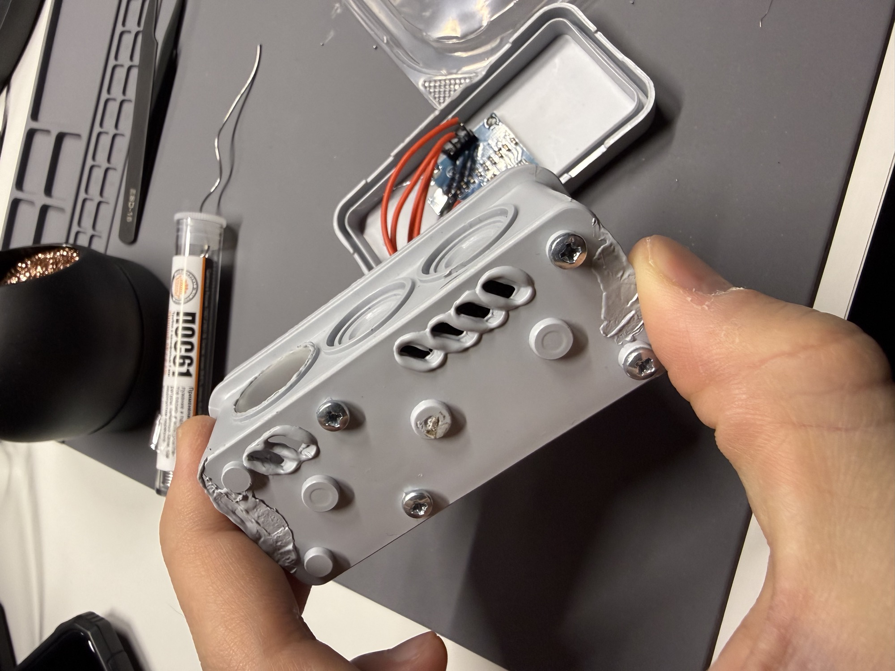
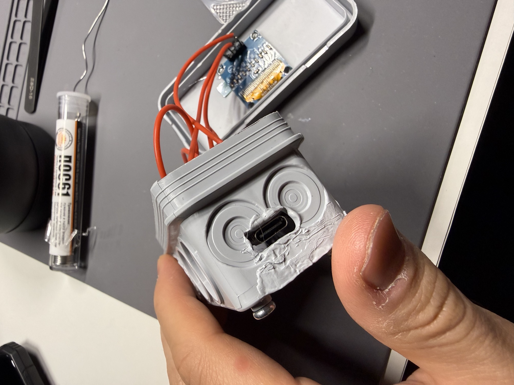
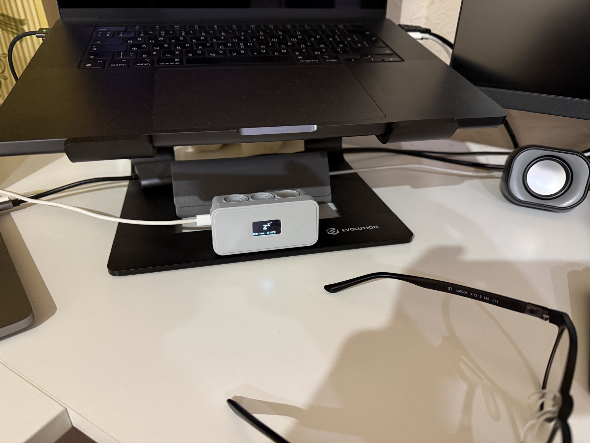
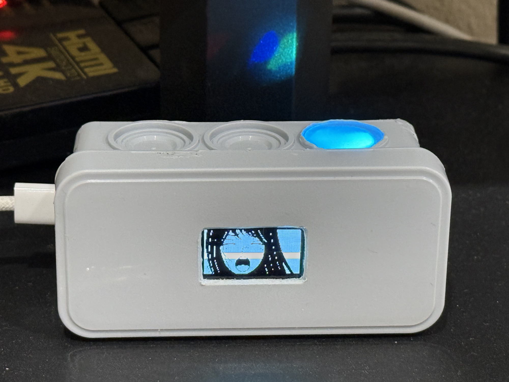
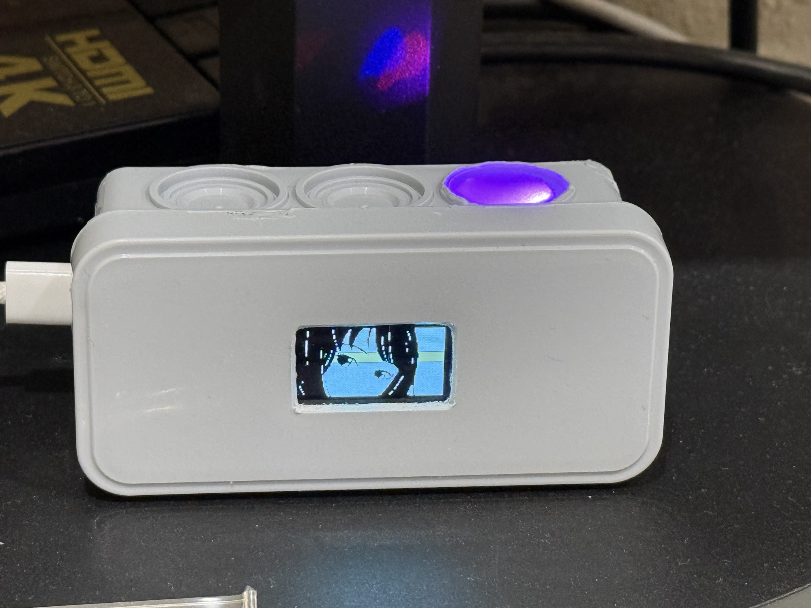

## External GUI for AI Voice Assistant (ESP32)  
A small DIY device that mirrors the current state of a voice assistant, visible both when the MacBook screen is on **and** when it is off.

### Purpose
Displays the assistant’s state (*listening / thinking(loading or processing) / speaking / sleeping*) via an OLED display showing anime-tyan face emotions.  
The key benefit is continuous visibility: even with the MacBook screen turned off, it’s immediately clear what the current state is.

### Hardware
- ESP32  
- 0.96" OLED (I2C)  
- WS2812B (1 LED for status/accent)

### How It Works
- Always connected to Wi‑Fi  
- Receives status commands over the network from the client
- Powered via USB‑C  
- Nightly automatic Wi‑Fi restart for long‑term stability

### UX Details
- Expressive OLED graphics matching the current state  
  (a single LED would be sufficient, but visuals improve readability and add personality)  
- Instant, glanceable feedback regardless of the main display state  
- Designed as a status mirror without exposing internal assistant logic

### Case & Assembly
- Disassemblable case (repair / reuse / upgrades)  
- PCB secured with four screws, suitable for frequent USB‑C interaction  
- Ventilation holes for passive airflow
- The LED light diffuser was hand‑shaped using a needle file, made from an old compact disc case

### Performance  
- Code is optimized for near‑instant response, enabling real‑time status indication  

### Architecture Advantage
The assistant core runs on a MacBook Pro, while this device acts purely as an external GUI and status mirror.

### Benefits
- Leverages the MacBook Pro’s processing power to run AI logic and local scripts  
- Assistant performance automatically improves with Mac hardware upgrades  
- The GUI device remains unchanged over time; only the core evolves  
- No need to rebuild or replace the hardware UI when updating the assistant  
- Fits naturally into an existing workflow where the Mac is already a primary tool

## License

MIT

